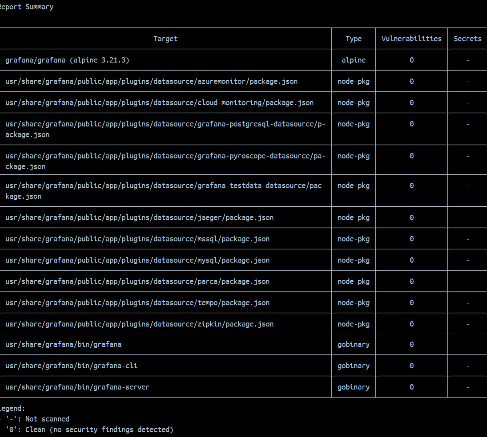

# DevOps Pipeline for a Multi-Service Application

## Table of Contents

1. [Project Overview](#project-overview)
2. [Backend (FastAPI)](#backend-fastapi)
3. [Frontend (HTML, CSS, JavaScript)](#frontend-html-css-javascript)
4. [Containerization with Docker](#containerization-with-docker)

   * [Dockerfile for Backend](#dockerfile-for-backend)
   * [Dockerfile for Frontend](#dockerfile-for-frontend)
5. [Docker Compose Integration](#docker-compose-integration)
6. [Setting Up Prometheus and Grafana](#setting-up-prometheus-and-grafana)
7. [Post-Mortem Analysis: Backend Service Failure](#post-mortem-analysis-backend-service-failure)

---

## Project Overview

This project demonstrates a full DevOps pipeline for a containerized multi-service application consisting of:

* A **FastAPI** backend that manages a bookstore.
* A **static frontend** using HTML, CSS, and JavaScript.
* Both services containerized with **Docker** and orchestrated via **Docker Compose**.

---

## Backend (FastAPI)

The backend service is built using FastAPI and SQLModel to provide REST APIs to:

* Add a new book
* Retrieve all books
* Retrieve a book by ID
* Delete a book

### Book Model

```python
class Book(SQLModel, table=True):
    id: Optional[int] = Field(default=None, primary_key=True)
    title: str = Field(min_length=1, max_length=50)
    author: str = Field(min_length=1, max_length=50)
    year: int
    genre: Optional[str] = Field(default=None, max_length=50)
```

---

## Frontend (HTML, CSS, JavaScript)

The frontend is a static website built with:

* HTML for structure
* CSS for styling
* JavaScript for fetching and displaying books via the backend API

Features:

* Display all books
* Add a new book
* Delete a book

---

## Containerization with Docker

### Dockerfile for Backend

```dockerfile
FROM python:3.11-slim

# Set working directory to /app
WORKDIR /app

# Copy and install dependencies
COPY requirements.txt .
RUN pip install --no-cache-dir -r requirements.txt

# Copy the entire backend including src/
COPY . .

# Set working directory inside the container to /app/src
WORKDIR /app/src

# Expose FastAPI's port
EXPOSE 8000

# Run the FastAPI server using `fastapi dev`
CMD ["fastapi", "dev", "main.py", "--host", "0.0.0.0", "--port", "8000"]
```

### Dockerfile for Frontend

```dockerfile
FROM nginx:alpine

# Copy static files to the nginx html directory
COPY . /usr/share/nginx/html

# Expose default NGINX port
EXPOSE 80
```

---

## Docker Compose Integration

A `docker-compose.yml` file orchestrates both services:

```yaml
services:
  backend:
    build: ./backend
    container_name: bookstore-backend
    ports:
      - "8000:8000"
    working_dir: /app/src
    volumes:
      - ./backend:/app
    command: fastapi dev main.py --host 0.0.0.0 --port 8000

  frontend:
    build: ./frontend
    container_name: bookstore-frontend
    ports:
      - "8080:80"
    depends_on:
      - backend
```

---


At this stage, both services are containerized and interact seamlessly via Docker Compose.

--- 

## Setting Up Prometheus and Grafana

### 1. Docker Compose Configuration

Add the following services in `docker-compose.yml`:

```yaml
prometheus:
  image: prom/prometheus
  volumes:
    - ./monitoring/prometheus.yml:/etc/prometheus/prometheus.yml
  ports:
    - "9090:9090"

grafana:
  image: grafana/grafana
  ports:
    - "3000:3000"
  volumes:
    - ./monitoring/grafana:/var/lib/grafana
  environment:
    - GF_SECURITY_ADMIN_USER=admin
    - GF_SECURITY_ADMIN_PASSWORD=admin
```

---

### 2. Monitoring Directory Setup

#### Create `monitoring/prometheus.yml`:

```yaml
global:
  scrape_interval: 15s

scrape_configs:
  - job_name: "fastapi"
    static_configs:
      - targets: ["backend:8000"]
```

#### Create `monitoring/grafana/provisioning/dashboards/dashboard.yml`:

```yaml
apiVersion: 1
providers:
  - name: "default"
    folder: ""
    type: file
    options:
      path: /var/lib/grafana/dashboards
```

#### Create `monitoring/grafana/provisioning/datasources/prometheus.yml`:

```yaml
apiVersion: 1
datasources:
  - name: Prometheus
    type: prometheus
    access: proxy
    url: http://prometheus:9090
    isDefault: true
```

---

### 3. Backend Instrumentation

In `backend/src/main.py`, add Prometheus instrumentation:

```python
from prometheus_fastapi_instrumentator import Instrumentator

# Instrument Prometheus metrics
Instrumentator().instrument(app).expose(app)
```

---

### 4. Run the Application

Use the following command:

```bash
docker compose up --build
```

Access services at:
* **Backend (FastAPI):** [http://localhost:8000](http://localhost:8000)
* **FastAPI Docs:** [http://localhost:8000/docs](http://localhost:8000/docs)
* **Frontend (Bookstore UI):** [http://localhost:8080](http://localhost:8080)
* **Prometheus**: [http://localhost:9090](http://localhost:9090)
* **Grafana**: [http://localhost:3000](http://localhost:3000)

---

### 5. Prometheus Setup

* Go to **Status > Targets**
* Confirm `backend:8000` target is healthy and reachable


---

### 6. Grafana Setup

* Login at [http://localhost:3000](http://localhost:3000) (user: admin / password: admin)
* Go to **Data Sources** via the menu
* If Prometheus isn't listed, click **Add data source**
* Enter the URL as `http://prometheus:9090`
* Save and test


---

### 7. Create Dashboards

* From the Grafana menu, go to **Dashboards > New > New Dashboard**
* Click **Add Visualization**
* Choose **Prometheus** as the data source
* Under **Metric**, add:

  * `process_cpu_seconds_total`
  * `process_resident_memory_bytes`


Example dashboards after backend was shut down and restarted:


---

## Security Scanning with Trivy

Trivy is used to scan Docker images for vulnerabilities. Below are the scan results for each image in the project, focusing on **CRITICAL** severity.

---

### Backend Image: `devops_pipeline_for_multi-service_app-backend`

```bash
docker run --rm -v /var/run/docker.sock:/var/run/docker.sock \
  aquasec/trivy image --severity CRITICAL --format table \
  devops_pipeline_for_multi-service_app-backend
```


* **Findings:** 1 critical vulnerability
* **Status:** Marked as `will_not_fix`, typically indicating it's either irrelevant in context or acknowledged by maintainers and intentionally left unresolved.

---

### 🔹 Frontend Image: `devops_pipeline_for_multi-service_app-frontend`

```bash
docker run --rm -v /var/run/docker.sock:/var/run/docker.sock \
  aquasec/trivy image --severity CRITICAL --format table \
  devops_pipeline_for_multi-service_app-frontend
```


* **Findings:** No critical vulnerabilities detected.

---

### 🔹 Prometheus Image: `prom/prometheus`

```bash
docker run --rm -v /var/run/docker.sock:/var/run/docker.sock \
  aquasec/trivy image --severity CRITICAL --format table \
  prom/prometheus
```


* **Findings:** No critical vulnerabilities detected.

---

### 🔹 Grafana Image: `grafana/grafana`

```bash
docker run --rm -v /var/run/docker.sock:/var/run/docker.sock \
  aquasec/trivy image --severity CRITICAL --format table \
  grafana/grafana
```



* **Findings:** No critical vulnerabilities detected.

---

## Post-Mortem Analysis: Backend Service Failure

### Overview

This section describes the expected system behavior and monitoring insights when the **backend container is intentionally shut down**. It includes observed outcomes in the frontend, Prometheus, and Grafana, as well as a brief post-mortem report.

---

### Step-by-Step Breakdown

#### Initial Setup

Ensure the following containers are running via `docker compose up`:

* Backend (FastAPI)
* Frontend (NGINX + static site)
* Prometheus
* Grafana

#### Simulating Failure

1. Use Docker Desktop (or CLI) to stop the **backend container**.
2. Confirm backend shutdown by visiting:

   * [http://localhost:8000](http://localhost:8000) → Should now be **unreachable**.
   * [http://localhost:8080](http://localhost:8080) (Frontend) → Should load, but **book fetching, adding, and deleting will fail**.

#### Prometheus Observation

1. Open Prometheus UI: [http://localhost:9090/targets](http://localhost:9090/targets)
2. Look at **Target Status** → The backend will be shown as `DOWN`.


#### Grafana Observation

1. Open Grafana UI: [http://localhost:3000](http://localhost:3000)
2. View a dashboard with backend metrics (e.g., CPU, memory).
3. As time passes, no new data points will be plotted. Existing metric lines will **flatline**, indicating no incoming data.


---

### Post-Mortem Summary

**Incident**: Backend container was intentionally stopped to simulate failure.

**Impact**:

* API at `/books` became unreachable.
* Frontend unable to display or modify books.
* Prometheus marked the backend as `DOWN`.
* Grafana dashboards showed no new metrics.

**Detection**:

* Prometheus `/targets` showed backend unreachable.
* Grafana stopped receiving data for backend metrics.

**Resolution**:

* Restarted backend container.
* System returned to normal.
